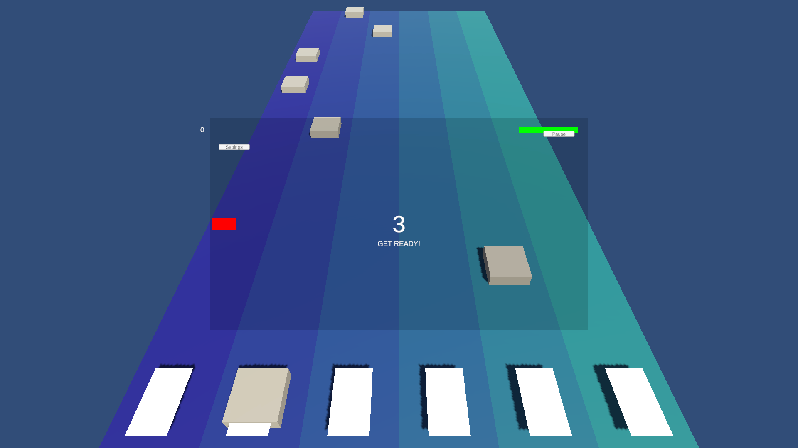
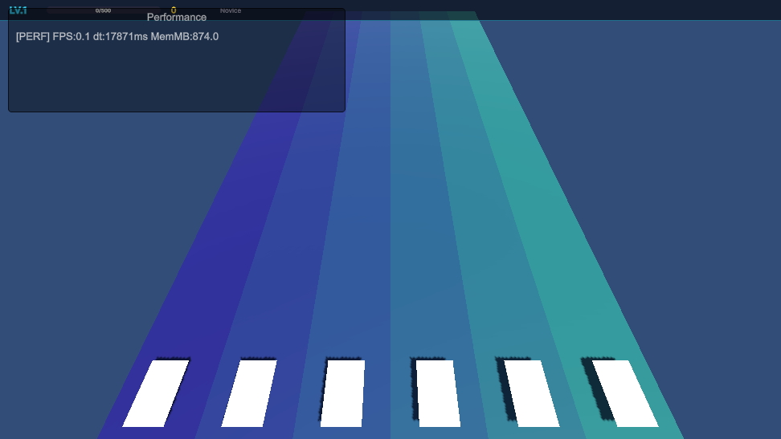

# TilesWorld

TilesWorld is a 3D six-lane rhythm game prototype. Behind this small preview is a deeper Unity rhythm system with perspective note flow, timing windows, real-time hit feedback, instrument mapping, and mobile-ready lane gameplay.

## Gameplay Preview

